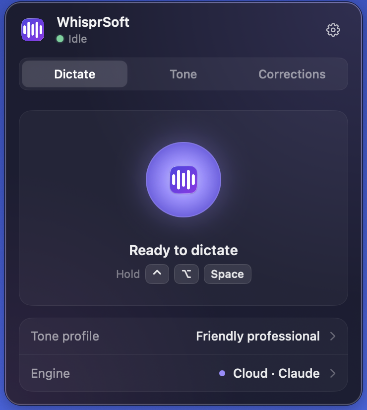
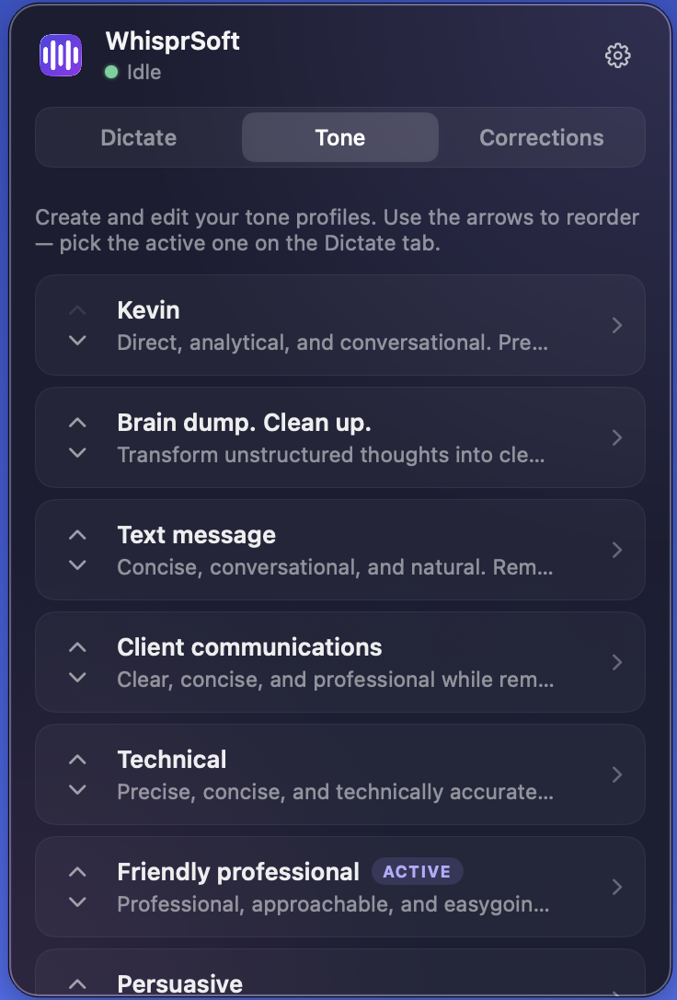
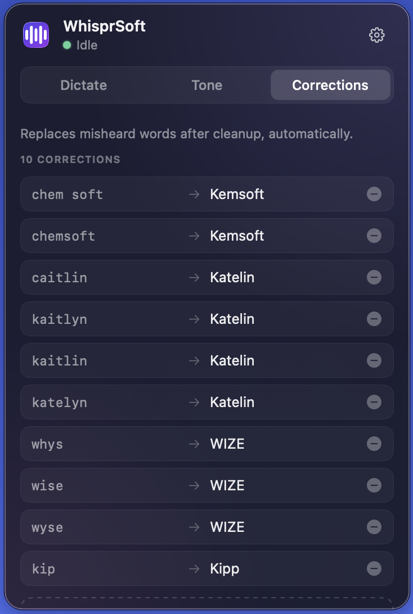
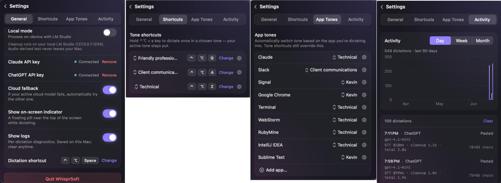

# WhisprSoft

A menu-bar dictation app for macOS. Hold **⌃⌥Space** (Control-Option-Space) to
dictate; release, and your speech is transcribed and pasted into whatever app is
focused. Transcription runs **on-device** — your audio never leaves the Mac.

## What it does

- **Hold-to-talk dictation.** Press and hold ⌃⌥Space, speak, and release. While
  you hold the chord the app records; on release it transcribes and types the
  result into the frontmost app.
- **On-device transcription.** Speech is transcribed locally with
  [WhisperKit](https://github.com/argmaxinc/argmax-oss-swift). The Whisper model
  downloads automatically on first use (a few hundred MB), then runs offline.
- **Optional transcript cleanup.** The raw transcript can be lightly cleaned up
  (punctuation, grammar, filler removal) before it's pasted. Two modes:
  - **Cloud** — a hosted model via API. Choose the provider inline on the
    **Dictate** tab's **Engine** row: **Claude** (Anthropic, `claude-haiku-4-5`)
    or **ChatGPT** (OpenAI, `gpt-4.1-mini`). Each provider has its own API key,
    added in **Settings**; selecting a provider with no key yet sends you to
    Settings to add one. Switching providers takes effect on the next dictation.
  - **Local Mode** — a local [LM Studio](https://lmstudio.ai) instance at
    `127.0.0.1:1234`. No key, nothing leaves the Mac. Unchanged by the cloud
    provider choice — Local Mode is always on-device.
  - With no key and Local Mode off, the raw transcript is pasted as-is.
- **Tone profiles.** Pick a tone for the cleaned-up text from a user-editable
  list of profiles (full create/edit/delete/reorder). Each profile is a short
  instruction — e.g. "Professional" or "Casual" — that nudges the wording while
  the cleanup keeps your own sentences, structure, and meaning. Selecting
  **Default** leaves the cleanup unchanged. The active profile applies to both
  Cloud and Local cleanup, and changes take effect on the next dictation. Manage
  profiles on the **Tone** tab; choose the active one on the **Dictate** tab.
- **Target language.** Pick an output language from a fixed list of ~20 major
  languages. When you choose a non-default language, the cleaned-up text is
  translated into it before it's pasted — so you can speak English and paste
  Spanish, French, Japanese, and so on. The default, **English (United States)**,
  means no translation (the text stays in the language you spoke). Translation
  rides on the same cleanup step, so it works in both Cloud and Local modes, and
  the choice takes effect on the next dictation. Pick the language on the
  **Dictate** tab. (Transcription itself is still English-tuned, so the reliable
  path is *speak English → paste another language*.)
- **Keyword corrections.** A deterministic, user-editable find-and-replace list
  (e.g. fix a name Whisper consistently mishears) is applied *after* cleanup, so
  neither Whisper nor the cleanup model can reintroduce the wrong spelling.
- **Quick-note scratchpad.** If you dictate while the menu-bar popover is open —
  when there's no text field to paste into — the cleaned-up result is appended to
  a note box that animates open on the Dictate tab instead of being pasted. Each
  burst adds a new line; the full pipeline (cleanup, tone, language, corrections)
  still runs. The note is hand-editable, has **Copy** and **Clear** actions, and
  is kept in memory for the session (it survives closing and reopening the
  popover, but is cleared on quit and never written to disk). Dictating with the
  popover closed pastes into the frontmost app exactly as before.
- **Menu-bar agent.** Runs as a menu-bar item with no dock icon and no main
  window. Settings (API key, Local Mode, tone profiles, corrections) live in the
  menu.

## Screenshots

The whole app lives in a single menu-bar popover with three tabs (Dictate, Tone,
Corrections) plus a Settings screen behind the gear.

### Dictate

The home screen and live status display. The hero shows the current pipeline
state — *Ready to dictate* at idle (with the **⌃⌥Space** hold-to-talk hint),
an animated waveform while recording, and a spinner while transcribing or
cleaning up. The card below is the quick-access control panel: **Language** picks
the output language — leave it on *English (United States)* for no translation,
or choose another to have the cleaned-up text translated before it's pasted;
**Tone profile** picks the active tone for cleanup (this is the only place the
active tone is chosen); and **Engine** picks the cleanup backend. In Cloud mode
it's an inline switcher between **Claude** and **ChatGPT** — selecting a provider
with a stored key switches instantly, while one without a key (shown with an
*Add key* hint) jumps to Settings so you can add it. In Local mode the row reads
*Local · LM Studio* and links to Settings.

If you dictate while this popover is open, the cleaned-up text is routed to a
**note box** that animates open just below the hero (instead of being pasted
into another app). Each burst appends a new line; the box is hand-editable and
has **Copy** and **Clear** actions. The note lives in memory for the session —
it survives closing and reopening the popover but is cleared on quit.

### Tone

Manage your rewrite tone profiles. Each profile is a short instruction that
nudges the wording of the cleaned-up text while preserving your own sentences,
structure, and meaning. Tap a card to expand and edit its name and instruction,
or delete it; use the up/down arrows to reorder. The profile marked **Active**
is the one currently selected on the Dictate tab. This tab is management only —
selecting the active tone happens back on Dictate.

### Corrections

A deterministic find-and-replace list applied *after* cleanup, just before the
text is pasted — so neither Whisper's mishearing nor the cleanup model can
reintroduce a wrong spelling. Useful for proper names Whisper consistently gets
wrong (e.g. "chem soft" → "Kemsoft", "shit audio" → "Schiit Audio"). Matching is
case-insensitive and whole-word; the replacement is inserted with exactly the
casing you type. Add and remove rows inline.

### Settings

Behind the gear: the **Local mode** toggle (route cleanup to a local LM Studio
instance instead of the cloud), the **Claude API key** and **ChatGPT API key**
add/remove flows (each stored in the Keychain, shown here as Connected), the
**Dictation shortcut** reference, Quit, and the app version. Add whichever cloud
provider's key you plan to use; switch between them from the Dictate tab's Engine
row.

## Privacy

- **Audio is always transcribed locally and never leaves your Mac.**
- The **text** transcript is sent to a cloud provider (Anthropic for Claude, or
  OpenAI for ChatGPT) **only** when Cloud cleanup mode is active *and* the
  selected provider's API key is set. In every other configuration the transcript
  stays on the Mac.
- **Local Mode is local-only.** If the local model is unreachable or fails, it
  falls back to pasting the raw transcript — **never** to the cloud. Audio-derived
  text leaves the Mac only in Cloud mode.
- The cloud API keys are stored in the login **Keychain** (entered through the
  menu), never in source or config files.

## Requirements

- macOS **26.5** or later.
- **Xcode 26.5** to build.

## Build & run

1. Clone the repo and open `WhisprSoft.xcodeproj` in Xcode.
2. **Forkers must set their own signing identity.** In the target's
   **Signing & Capabilities**, select your own **Development Team** and change
   the **bundle identifier** to one you own. The committed project carries the
   original author's team id, which won't sign on your machine. (The App Sandbox
   is intentionally off and Hardened Runtime is on — Accessibility and synthetic
   keystroke injection are unsupported under the sandbox.)
3. Build and run. On first launch, grant the two required permissions (below).

### Permissions

WhisprSoft can't run until both are granted; it shows an onboarding
checklist until they are.

- **Microphone** — to record your voice. Granted inline via the standard prompt.
- **Accessibility** — to paste the transcribed text into the focused app
  (synthetic ⌘V). Granted in System Settings, then re-checked.

### Optional: transcript cleanup

- **Cloud** — add an API key in Settings for your chosen provider: an Anthropic
  key for **Claude** (`claude-haiku-4-5`) or an OpenAI key for **ChatGPT**
  (`gpt-4.1-mini`). Pick the provider on the Dictate tab's Engine row; the
  transcript is cleaned up by it and pasted.
- **Local** — run LM Studio at `127.0.0.1:1234` with a model loaded, then enable
  **Local Mode** in the menu. Cleanup runs entirely on your machine.

## License

Copyright 2026 The WhisprSoft Authors. Licensed under the Apache License, Version 2.0.

This project is released under the [Apache License, Version 2.0](https://www.apache.org/licenses/LICENSE-2.0).
See the [`LICENSE`](LICENSE) file for the full text.
